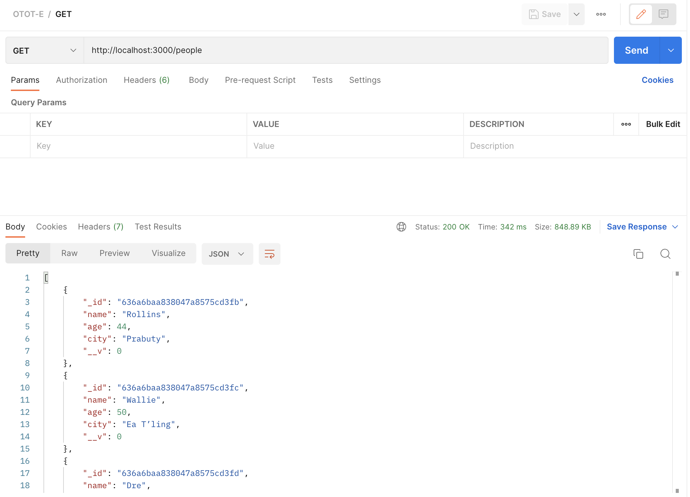
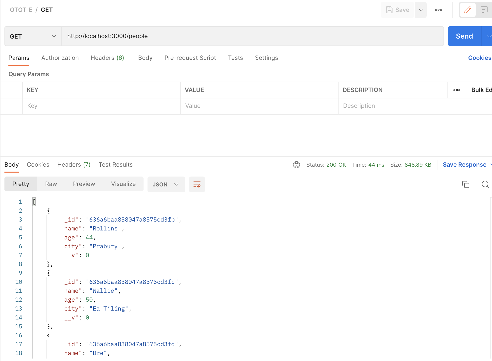

# A0200602E - BANERJEE ADITYA

### GitHub Repository
https://github.com/adidoesnt/OTOT-E

## Funtionality
1. GET request sent to retrieve 10000 records from server
2. Server checks cache for data. If it is not present it is retrieved from the local MongoDB database and cached.
3. Server responds to client with the data

## Effect of caching
- Before caching:

- After caching:
